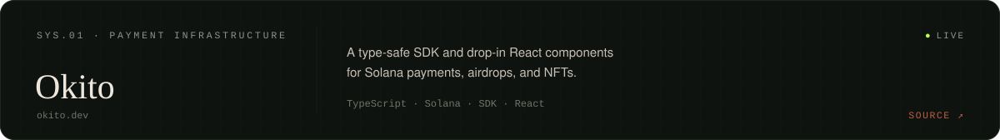
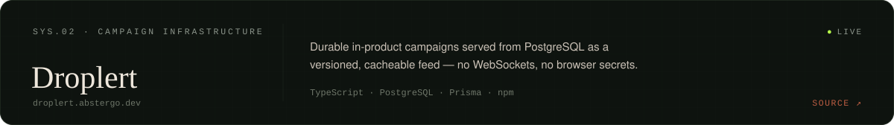
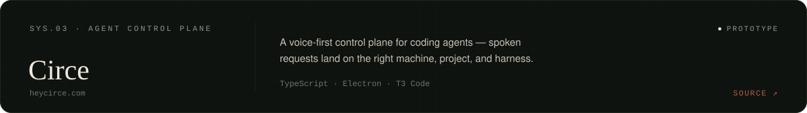
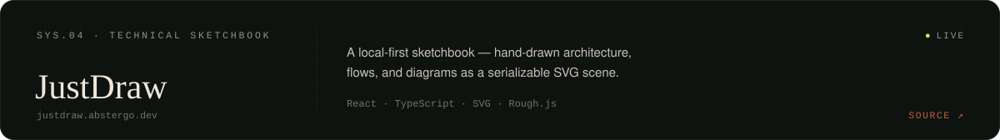
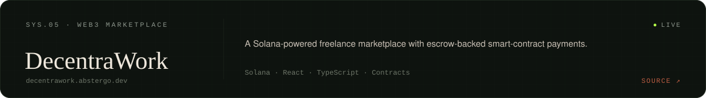
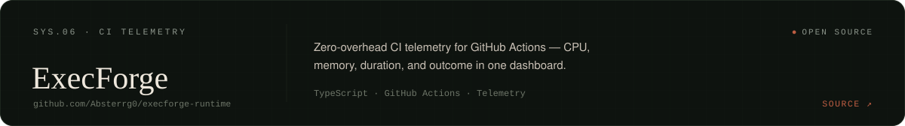

  

<h3 align="center">I design the interface and build the system behind it.</h3>

  <a href="https://abstergo.fyi"><b>PORTFOLIO</b></a>
  &nbsp;·&nbsp;
  <a href="https://www.linkedin.com/in/parv-jain-82169b297">LINKEDIN</a>
  &nbsp;·&nbsp;
  <a href="https://x.com/notabbytwt">X</a>
  &nbsp;·&nbsp;
  <a href="mailto:parvj5212@gmail.com">EMAIL</a>

Full-stack developer in Bengaluru building scalable backends, real-time data paths, and developer-first tools. I take products from interface decisions through backend architecture and deployment — most of what I ship starts as an experiment and ends as something people use end to end.

### 01 · Selected systems

LIVE BUILDS — <a href="https://okito.dev">okito.dev</a> · <a href="https://droplert.abstergo.dev">droplert.abstergo.dev</a> · <a href="https://heycirce.com">heycirce.com</a> · <a href="https://justdraw.abstergo.dev">justdraw.abstergo.dev</a> · <a href="https://decentrawork.abstergo.dev">decentrawork.abstergo.dev</a>

### 02 · Capability

- `LANGUAGES` — TypeScript · JavaScript · Python · Go · Rust · Solidity
- `INTERFACE` — React · Next.js · Tailwind · Motion · TanStack Query · Zustand
- `SYSTEMS` — Node.js · NestJS · PostgreSQL · Redis · Prisma · REST
- `PROTOCOL` — Solana · Anchor · Web3.js · Smart contracts
- `DELIVERY` — Docker · AWS · Linux · GitHub Actions · Vercel

### 03 · The record

Public activity, drawn from the GitHub API. Refreshed weekly by <a href="https://github.com/Absterrg0/Absterrg0/blob/main/.github/workflows/numbers.yml">numbers.yml</a>.

### 04 · Now

- Building **Circe** — a voice-first control plane for coding agents
- Maintaining **droplert** on npm — durable campaigns without WebSockets
- Exploring real-time systems, agent tooling, and Solana developer experience

---

Bengaluru · UTC +05:30 · Open to full-time, internships, and freelance — <a href="mailto:parvj5212@gmail.com">parvj5212@gmail.com</a> 
Bespoke profile — Georgia &amp; SF Mono, drawn from the GitHub API · <a href="https://abstergo.fyi">MMXXVI / Abstergo</a>
