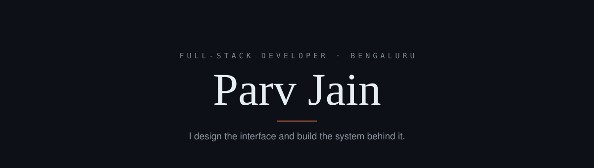

  

  <a href="https://abstergo.fyi">portfolio</a>
  ·
  <a href="https://www.linkedin.com/in/parv-jain-82169b297">linkedin</a>
  ·
  <a href="https://x.com/notabbytwt">x</a>
  ·
  <a href="mailto:parvj5212@gmail.com">email</a>

  

  

  <picture>
    <source media="(prefers-color-scheme: dark)" srcset="https://raw.githubusercontent.com/Absterrg0/Absterrg0/output/github-snake-dark.svg" />
    <source media="(prefers-color-scheme: light)" srcset="https://raw.githubusercontent.com/Absterrg0/Absterrg0/output/github-snake.svg" />
    
  </picture>

Bengaluru · UTC +05:30 · open to full-time, internships, and freelance — <a href="mailto:parvj5212@gmail.com">parvj5212@gmail.com</a>
