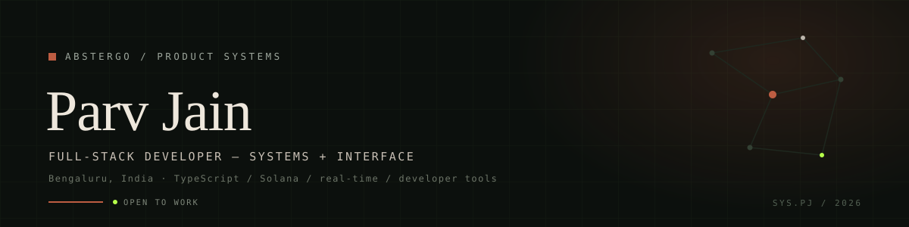
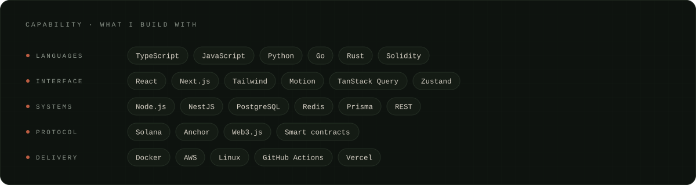
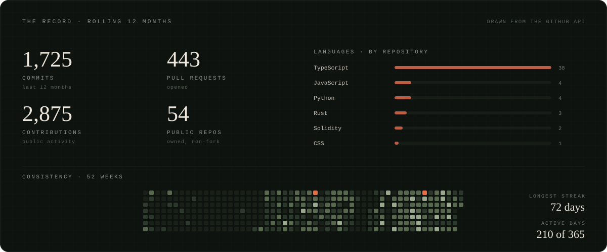

  

<h3 align="center">I design the interface and build the system behind it.</h3>

  <a href="https://abstergo.fyi"><b>PORTFOLIO</b></a>
  &nbsp;·&nbsp;
  <a href="https://www.linkedin.com/in/parv-jain-82169b297">LINKEDIN</a>
  &nbsp;·&nbsp;
  <a href="https://x.com/notabbytwt">X</a>
  &nbsp;·&nbsp;
  <a href="mailto:parvj5212@gmail.com">EMAIL</a>

Full-stack developer in Bengaluru building scalable backends, real-time data paths, and developer-first tools — most of what I ship starts as an experiment and ends as something people use end to end.

Public activity, drawn from the GitHub API. Refreshed weekly by <a href="https://github.com/Absterrg0/Absterrg0/blob/main/.github/workflows/numbers.yml">numbers.yml</a>.

Bengaluru · UTC +05:30 · Open to full-time, internships, and freelance — <a href="mailto:parvj5212@gmail.com">parvj5212@gmail.com</a>
